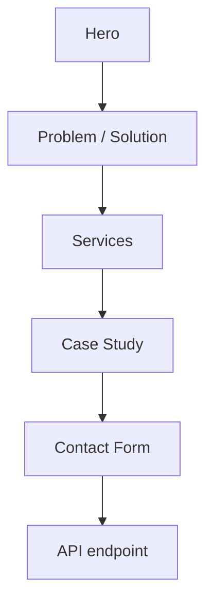

# osmi

<div align="center">

### Digital Presence Architecture for humans, search engines, and AI


</div>

A multilingual digital-services landing page focused on **web development**, **SEO**, **Generative Engine Optimization (GEO)**, and **Google Maps visibility**.

## ✦ What is osmi?

osmi is built around a simple idea: a business should be discoverable not only through traditional search, but also through the new generation of AI-driven discovery.

The site presents four core services:

- **Web Development** — fast, minimalist websites with a strong technical foundation.
- **SEO** — technical and content optimization for conventional search.
- **GEO** — content and data structure designed for generative AI discovery.
- **Google Maps** — local visibility and profile optimization.

## ✨ Experience

- multilingual locale-aware routing;
- animated hero and content sections;
- smooth scrolling;
- responsive typography and layouts;
- case-study presentation;
- contact form with loading, success, and error states;
- server API endpoint for contact requests;
- localized metadata.

## 🌍 Internationalization

Localization is implemented with **next-intl**. Translation dictionaries live in `messages/`, while localized pages use the `src/app/[locale]` route.

## 🧱 Tech stack

| Area | Technology |
|---|---|
| Framework | Next.js 16 |
| UI | React 19 |
| Language | TypeScript |
| Styling | Tailwind CSS 4 |
| Animation | Framer Motion |
| Smooth scroll | Lenis |
| Internationalization | next-intl |
| Icons | Lucide React |

## 🚀 Local development

```bash
git clone https://github.com/xondell/osmi.git
cd osmi
npm install
npm run dev
```

## 📦 Commands

```bash
npm run dev
npm run build
npm run start
npm run lint
```

## 📁 Project structure

```text
osmi/
├── messages/               # Localized content
├── public/                 # Static assets
└── src/
    ├── app/
    │   ├── [locale]/       # Localized landing page
    │   └── api/            # Server API routes
    ├── components/         # Landing UI and interactions
    ├── i18n/               # Internationalization configuration
    └── proxy.ts            # Locale routing logic
```

## 🧭 Page flow



## 🎨 Design philosophy

The interface uses oversized typography, black-and-white contrast, generous whitespace, restrained animation, and responsive layouts instead of a conventional agency-template look.

---

<div align="center">

**osmi — digital presence built for the way people discover businesses now.**

</div>
